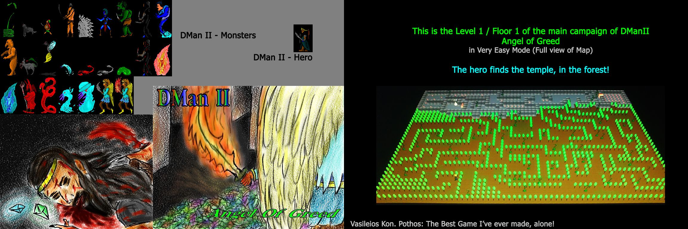

# Diamond Man II (DMan_II)

Diamond man was my first game developed in QBasic. The basic purpose is to gather diamonds, fight monsters, and level up yourself while solving labyrinths and puzzles!

Diamond Man II (DMan-II) is the 3D more advanced implementation which I created in university and more specifically for the PixelShow competition in 2005, where unfortunatelly, I had not the chance to present it, due to presentation issues. Nevertheless , I had created a whole campaing and a demonstration campaing along with map-editors etc.
As far as I can remember the game's engine is generic thus anyone can use it to generate new maps, new monsters and whole new campaigns. Unfortunatelly it can be played only on specific resolution on full-screen (the resolution of my pc back then!) thus if you don't support it, it may not even begin. I am not sure if I have it's source code still available.

The main purpose is to find the exit of each labyrinth / stage, which contains visible and hidden doors and levers while leveling up or buying exra tools to aid you against monsters of different levels which attack when they see you. Each monster when it sees you is attacking towards you with different speed and power, trying to zero out your power (hit and run is a good tactic some times!). Your power on the other hand depends on your fighting tools - it can recharge faster and have larger capacity. And except from the direct attacks, bombs etc can also be bought and used from any store you may encounter! So gather your diamonds!

Ps. Over the years, I have finished the first campains in total 3 times. I find this game a bit addictive...

